# Airline Loyalty Insights

## Deskripsi Project
Project ini menganalisis program loyalitas maskapai penerbangan menggunakan dataset customer flight activity dan customer loyalty history. Tujuannya adalah untuk mengungkap tren penerbangan, penggunaan poin loyalitas, dan mengidentifikasi korelasi antara loyalitas pelanggan dengan pendapatan.

## Struktur Project
Project ini tersusun dalam direktori berikut:

/airline_loyalty_insights

├── data/

│   ├── calendar.csv

│   ├── customer_flight_activity.csv

│   └── customer_loyalty_history.csv

├── output/

│   ├── graphs/

│   └── results/

└── analysis.py

## Langkah-langkah Eksekusi
### 1. Persiapan Lingkungan dan Instalasi
- Pastikan PySpark sudah terinstal di lingkungan Anda.
- Clone repository ini, kemudian navigasi ke folder project.

### 2. Jalankan Script
- Buka terminal, lalu jalankan `python analysis.py`.
- Script ini akan melakukan proses ekstraksi, pembersihan, transformasi data, serta menghasilkan output hasil analisis dan visualisasi dalam folder `output/`.

## Penjelasan Tahapan
### 1. Data Extraction
- Script `analysis.py` memuat file CSV dari folder `data/` ke dalam DataFrame PySpark, mencakup data aktivitas penerbangan dan riwayat loyalitas pelanggan.

### 2. Data Cleaning
- Dilakukan pengecekan nilai null, tipe data yang sesuai, dan penghapusan duplikat untuk memastikan kualitas data.

### 3. Data Transformation
- Data penerbangan dan loyalitas digabungkan untuk mendapatkan gambaran lengkap dari aktivitas pelanggan.
- Ditambahkan kolom `redeemed_percentage` untuk menghitung persentase poin yang digunakan, serta `loyalty_status` untuk kategori loyalitas pelanggan.

### 4. Data Analysis dan Visualisasi
- Analisis meliputi tren bulanan penerbangan, pengumpulan dan penggunaan poin, hubungan antara pendapatan dengan status loyalitas, jarak rata-rata penerbangan, dan persentase penggunaan poin berdasarkan status loyalitas.
- Hasil visualisasi disimpan dalam folder `output/graphs/` dan data hasil analisis dalam `output/results/`.

## Hasil Analisis
Setiap analisis divisualisasikan untuk memudahkan pemahaman:
- **Tren Penerbangan Bulanan**: Grafik menunjukkan perubahan jumlah penerbangan setiap bulan.
- **Penggunaan dan Pengumpulan Poin**: Menggambarkan total poin yang terkumpul dan digunakan bulanan.
- **Hubungan Pendapatan dan Status Loyalitas**: Menyajikan rata-rata pendapatan berdasarkan level loyalitas.
- **Rata-rata Jarak Penerbangan**: Analisis jarak penerbangan untuk mengetahui preferensi jarak perjalanan pelanggan.
- **Persentase Penggunaan Poin per Status Loyalitas**: Melihat persentase poin yang digunakan berdasarkan level loyalitas pelanggan.

## Struktur Output
Output hasil analisis dan visualisasi disimpan dengan format berikut:
- **Graphs** (`output/graphs/`): Berisi grafik dalam format PNG untuk setiap analisis.
- **Results** (`output/results/`): Berisi file CSV/Parquet hasil analisis, dengan nama yang menggambarkan isi datanya, seperti `trend_flights.csv`, `points_usage_by_loyalty_status.csv`, dll.

## Screenshot
- **Struktur Project Folder**:  
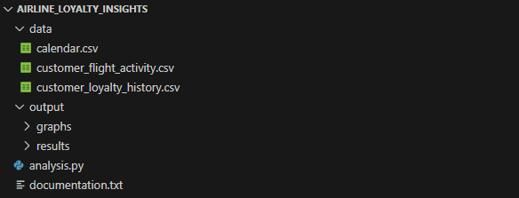

- **Script analysis.py**:  
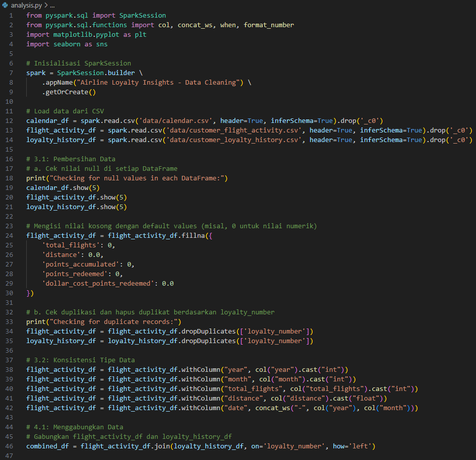  
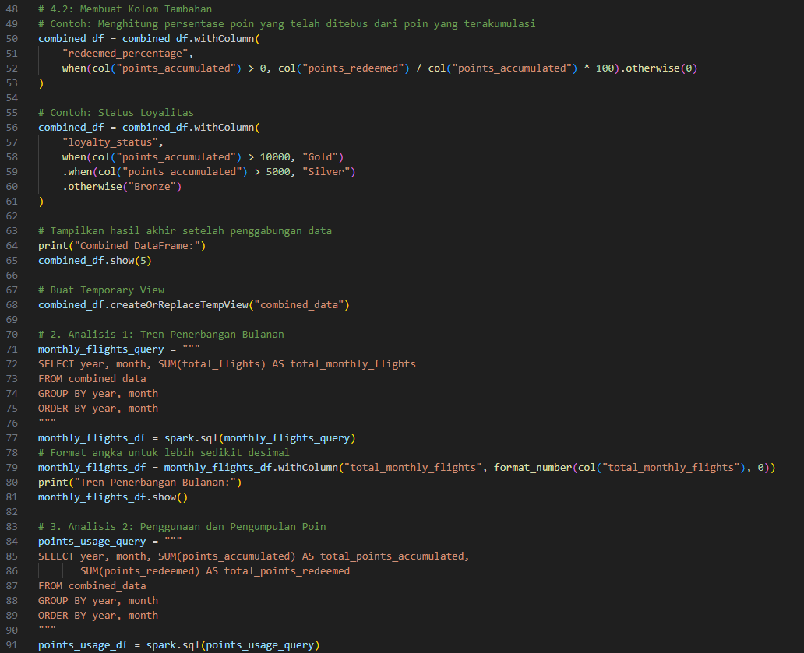  
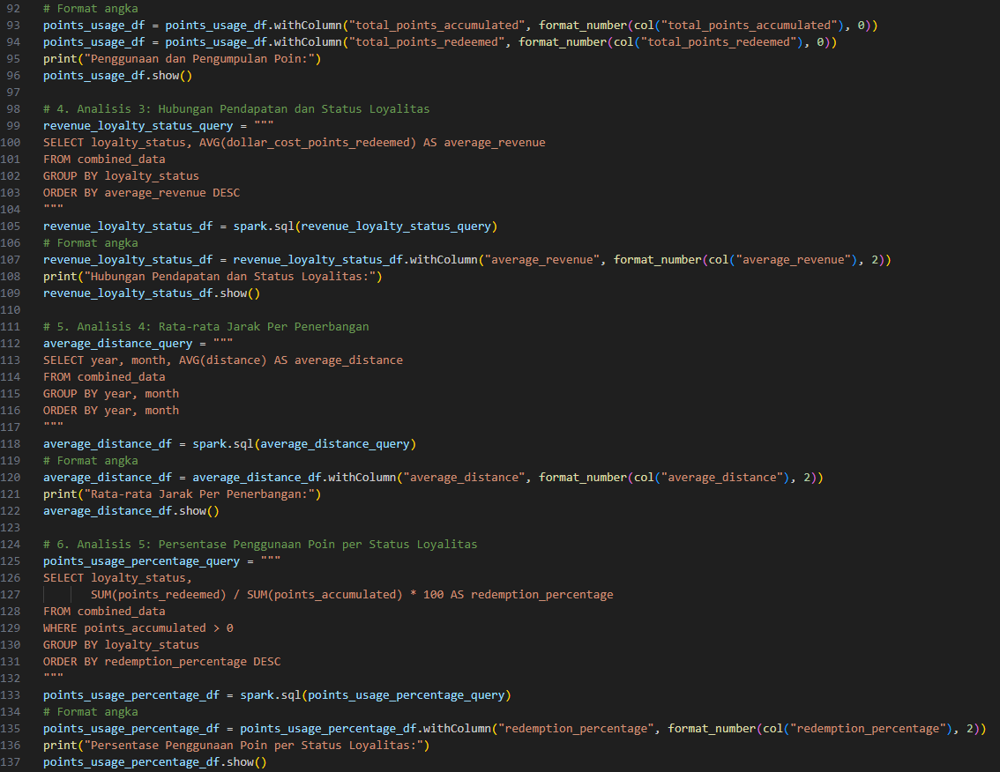  
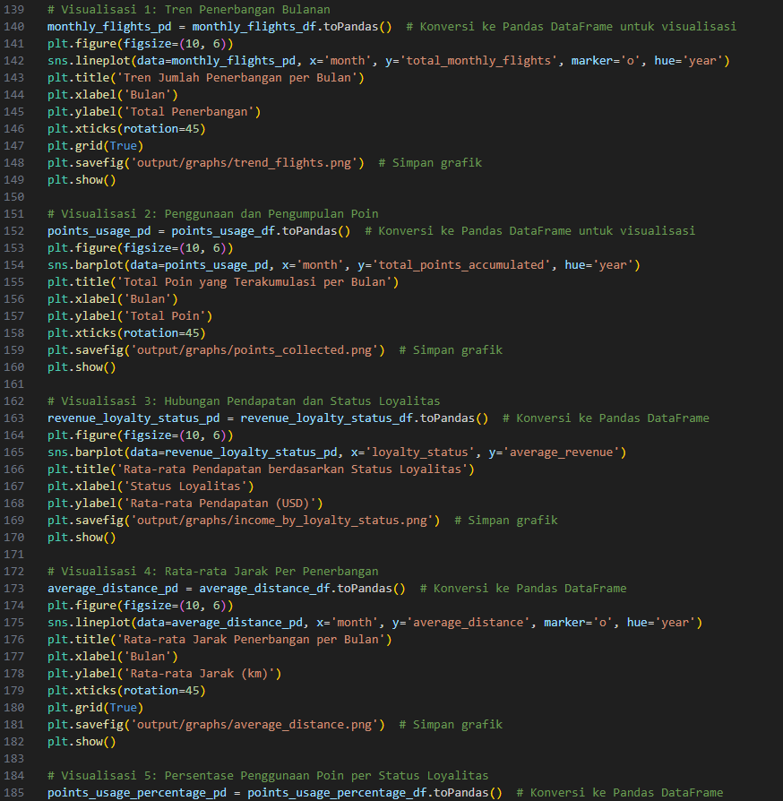  
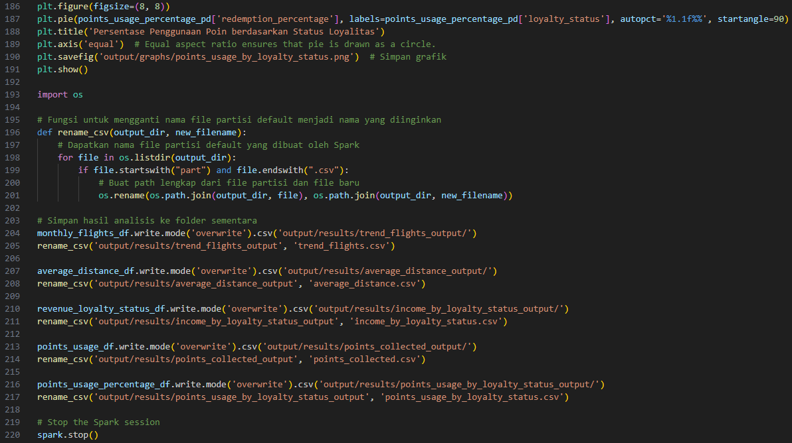

- **Hasil Visualisasi**:  
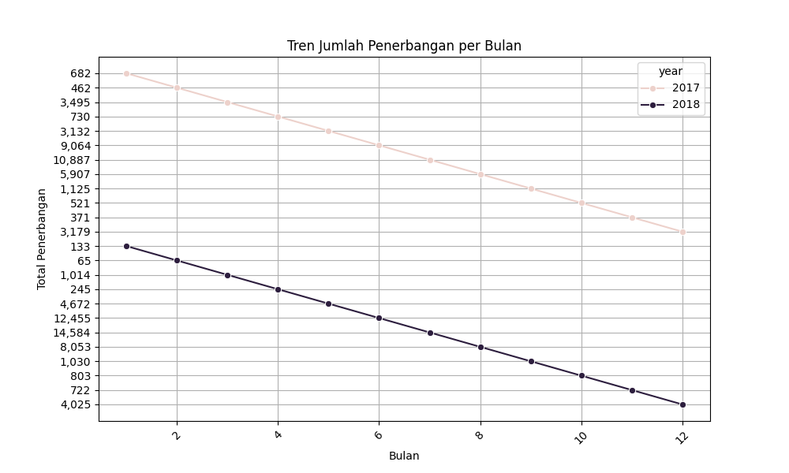  
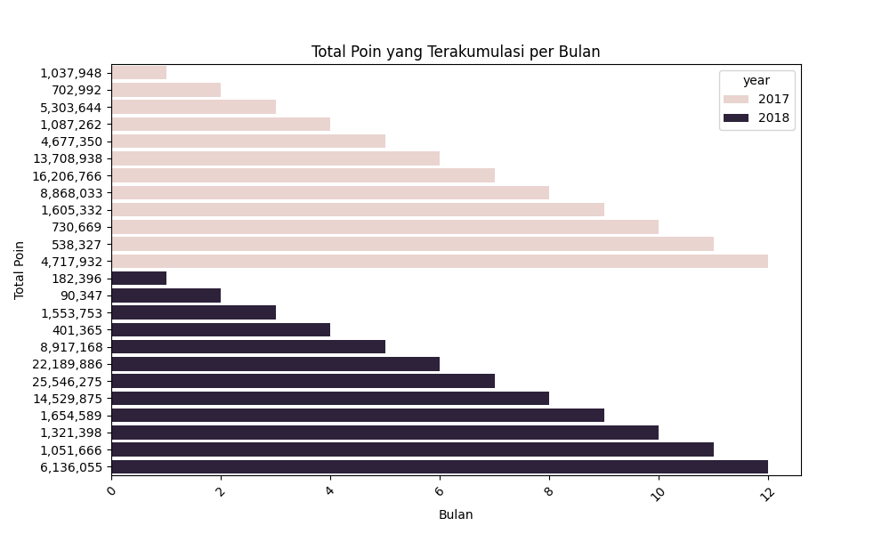  
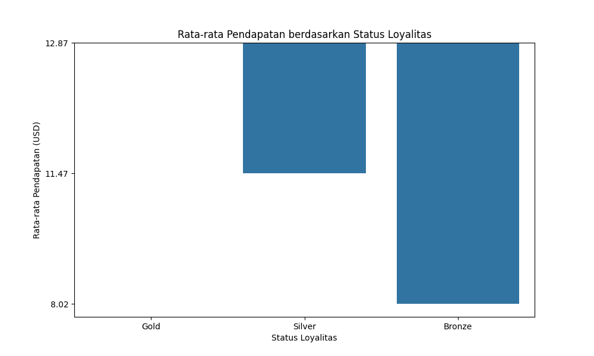  
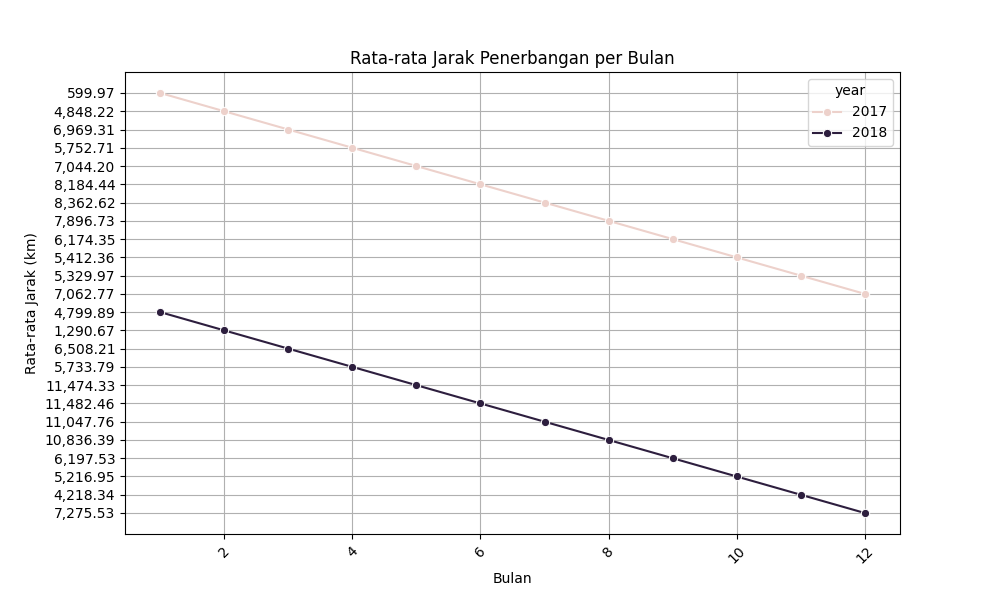  
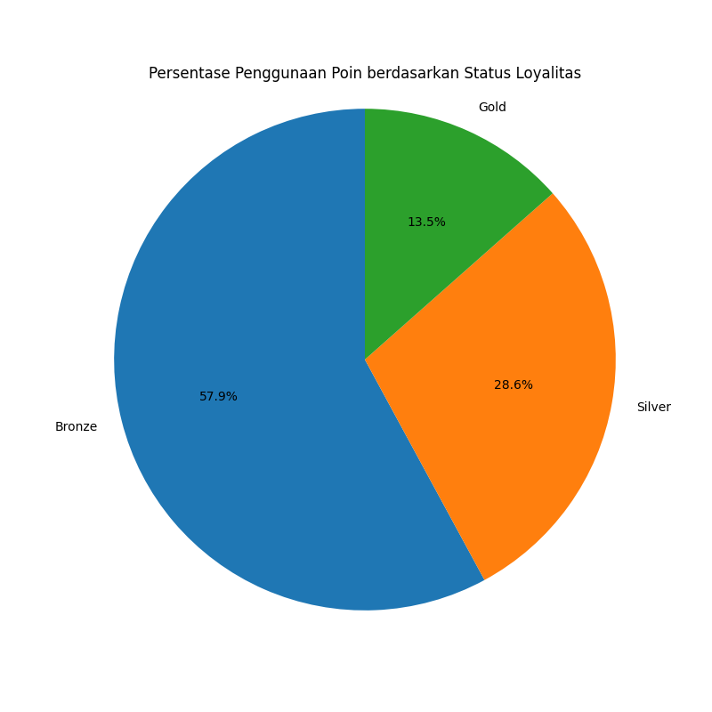

- **Output Hasil Akhir**:  
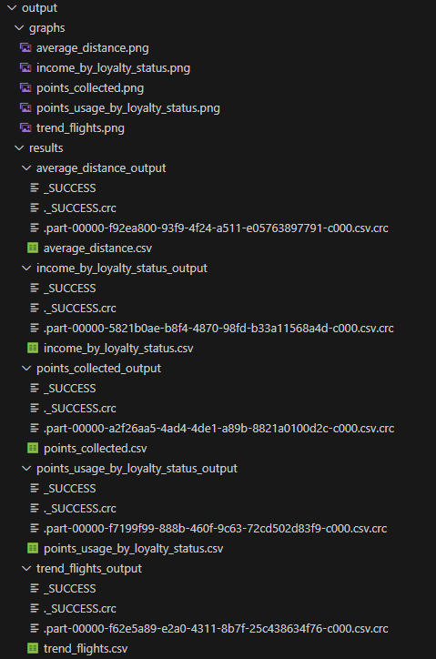
